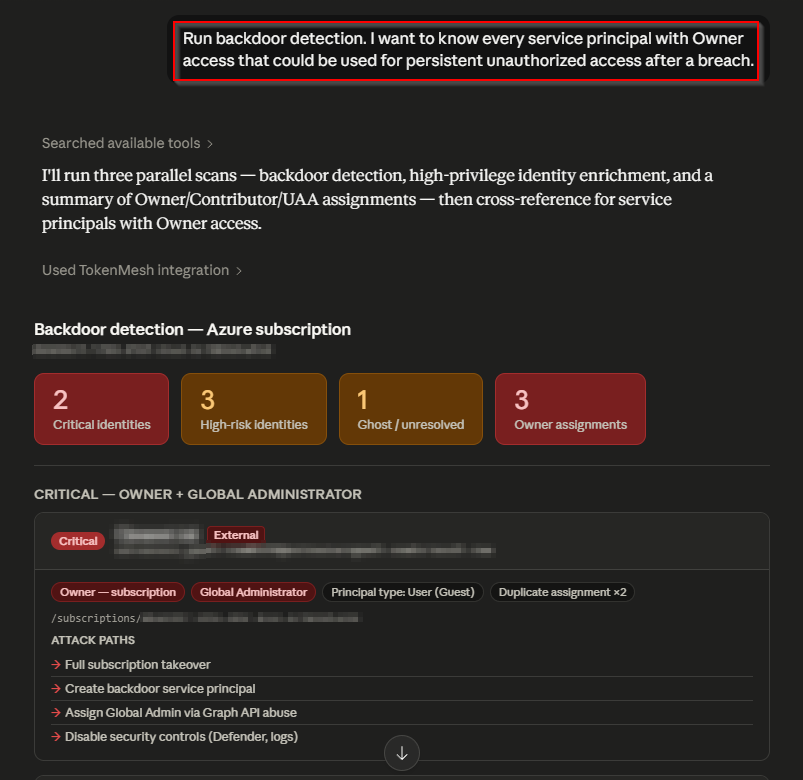
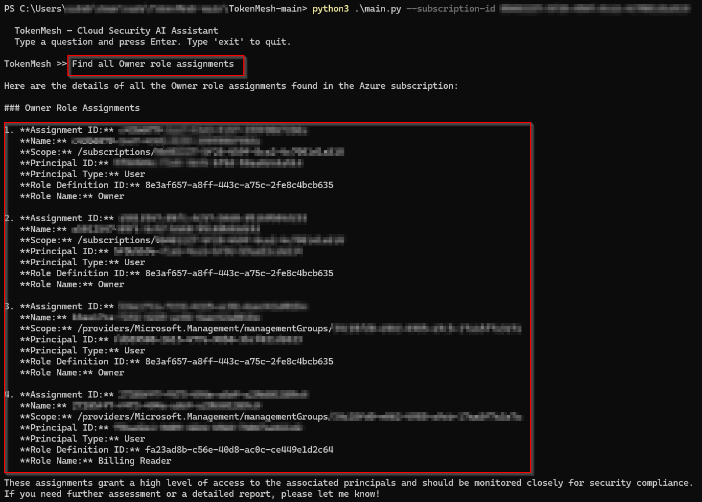

# TokenMesh 

### Cloud Security Assistant for Azure (MCP + LLM Integrated)

Understand your Azure attack surface in real time.

TokenMesh integrates Azure with MCP and LLMs to perform live security analysis across identities, roles, and resources. It surfaces privilege risks, misconfigurations, and attack paths directly from your environment—without manual enumeration.

Built for pentesters, red teamers, and defenders, TokenMesh combines cloud data with AI-driven reasoning to deliver fast, actionable security insights.

---

## Table of Contents

- [What is MCP?](#what-is-mcp)
- [Why TokenMesh?](#why-TokenMesh)
- [Installation](#installation)
- [Usage](#usage)
  - [Claude Desktop (MCP)](#method-1--claude-desktop-mcp)
  - [CLI / OpenAI Mode](#method-2--openai-mode)
- [Sample Output](#sample-output)
- [Security Prompts](#security-prompts)
- [Disclaimer](#disclaimer)

---

## What is MCP?

Model Context Protocol (MCP) is an open standard that allows AI models to interact with external tools and live data sources in a structured and secure way.

Think of MCP as a universal interface between:

- AI models (LLMs)
- External systems (APIs, databases, cloud environments)

Instead of copying data manually into an AI model, MCP enables:

- Direct tool execution
- Real-time data retrieval
- Structured JSON responses

## Why TokenMesh?

Azure environments are complex and distributed:

- Hundreds of RBAC assignments
- Multiple service principals and identities
- Storage accounts across regions
- Hidden privilege escalation paths

Traditional analysis requires:

- Azure Portal
- CLI / PowerShell
- Graph Explorer
- Manual correlation

TokenMesh h replaces this with a single natural language interface.

## Installation

Follow these steps to set up TokenMesh locally.

---

### Step 1 — Install Prerequisites

Make sure you have:

- Python 3.10 or higher
- Azure CLI installed
- MCP-compatible client (for MCP mode)
- OpenAI API key (for CLI mode)

---

### Step 2 — Clone the Repository

```
git clone https://github.com/<your-username>/TokenMesh.git
cd TokenMesh
```

---

### Step 3 — Create Virtual Environment

```
python -m venv venv
```

Activate it:

**Windows (PowerShell):**

```
.\venv\Scripts\Activate.ps1
```

**Linux / macOS:**

```
source venv/bin/activate
```

---

### Step 4 — Install Dependencies

```
pip install -r requirements.txt
```

---

### Step 5 — Authenticate to Azure

TokenMesh uses your Azure CLI session.

```
az login
```

Verify account:

```
az account show -o table
```

If needed, select subscription:

```
az account set --subscription "<your-subscription-id>"
```

---

### Step 6 — Verify Setup

Run:

```
python mcp_server.py
```

If no errors appear, installation is complete.

Press `Ctrl + C` to stop the server.

## Access Requirements

To use **TokenMesh**, your account needs read-only access:

- **Reader (Azure Subscription):** View resources and RBAC  
- **Global Reader (Entra ID):** View users, groups, and service principals  

These roles ensure data visibility while keeping everything strictly read-only.

## Usage

TokenMesh supports **two modes of operation**:

1. MCP Mode (for AI clients like Claude Desktop)
2. CLI Mode (direct terminal interaction using an LLM API)

---

## Method 1 — Claude Desktop (MCP)

Use this mode if you want an AI assistant to directly interact with your Azure environment.

---

### Step 1 — Locate MCP Config File (Claude Desktop)

Instead of manually searching for the config file, you can access it directly from the Claude Desktop UI:

1. Open Claude Desktop
2. Go to **Settings**
3. Navigate to the **Developer** section
4. Click on **“Edit Config”**

This will open the MCP configuration file (`claude_desktop_config.json`) in your default editor.

---

### Step 2 — Add TokenMesh Server

Add the following configuration:

```
{
  "mcpServers": {
    "TokenMesh": {
      "command": "python",
      "args": [
        ""C:\\path\\to\\TokenMesh\\mcp_server.py""
      ],
      "env": {
        "AZURE_SUBSCRIPTION_ID": "<your-subscription-id>"
      }
    }
  },
  "preferences": {
    <<Set Preferences>>
  }
}
```

Replace:

- `<path>` → full path to your TokenMesh directory
- `<your-subscription-id>` → from `az account show`

If your config already contains other sections, simply add `"mcpServers"` alongside them.

---

### Step 3 — Restart MCP Client

- Fully close Claude Desktop
- Make sure it is not running in the background (system tray)
- Reopen the application

---

### Step 4 — Verify Connection

Once the configuration is correct and the app is restarted:

1. Open Claude Desktop
2. Go to **Settings → Developer**
3. Look for the **MCP Servers section**

You should see **TokenMesh listed as a configured MCP server**

---

### Step 5 — Run Queries

Example queries:

- Find all high-privilege identities
- Detect backdoor service principals
- Show attack paths for this tenant

The AI will:

1. Call TokenMesh tools
2. Retrieve live Azure data
3. Return analyzed results

---

## Method 2 — CLI/OpenAI Mode

Use this mode if you prefer working directly from the terminal.

---

### Option A — Interactive Mode

Set your OpenAI API key as an environment variable

Windows (PowerShell):

```
$env:OPENAI_API_KEY="your-api-key-here"
```

macOS/Linux (bash/zsh):

```
export OPENAI_API_KEY="your-api-key-here"
```

Then Run:

```
python main.py --subscription-id <your-subscription-id> 
```

You will enter an interactive session:

```
TokenMesh >>
```

Type queries like:

```
Find all Owner role assignments
```

---

### Option B — One-Shot Query

Run a single command:

```
python main.py \
  --subscription-id <sub-id> \
  --openai-key <key> \
  --prompt "Detect privilege escalation paths"
```

---

## When to Use Which Mode?

| Mode | Best For |
| --- | --- |
| MCP Mode | Interactive AI-assisted analysis |
| CLI Mode | Automation, scripting, quick checks |

---

## Sample Output

### MCP Mode (Claude Desktop)

Query Azure directly via MCP-enabled client.

**Query:**
```
Run backdoor detection. I want to know every service principal with Owner
access that could be used for persistent unauthorized access after a breach.
```

**Output:**




### CLI Mode (ChatGPT / OpenAI)

Run security queries from terminal using LLM API.

**Query:**
```
Find all Owner role assignments
```

**Output:**



---

## Security Prompts

Ready-to-use prompts organized by category. Click a category to see all prompts:

### Red Team / Pentester

| Category | Description |
|---|---|
| [**Privilege Escalation Hunting**](prompts/privilege-escalation.md) | Find Owner/Contributor identities, crown jewel targets, ghost identities, UAA escalation |
| [**Backdoor & Persistence Detection**](prompts/backdoor-detection.md) | SP backdoors, guest user abuse, orphaned credentials, dual-access persistence |
| [**Storage Attack Surface**](prompts/storage-attack-surface.md) | Public blob access, weak TLS, HTTP downgrade, network-open accounts |
| [**Attack Path Analysis**](prompts/attack-path-analysis.md) | Kill chains, blast radius, shortest path to Owner, defender-disable paths |
| [**Lateral Movement & Scope Abuse**](prompts/lateral-movement.md) | Cross-scope identities, group escalation, managed identity risk, cross-tenant SPs |

### Blue Team / Defender

| Category | Description |
|---|---|
| [**Identity Hygiene & Governance**](prompts/identity-hygiene.md) | Disabled accounts with live roles, access reviews, CISO dashboards, stale access |
| [**Threat Detection & Hardening**](prompts/threat-detection.md) | Severity-ranked findings, MITRE mapping, least privilege audit, hardening checklists |
| [**Incident Response**](prompts/incident-response.md) | Compromised SP triage, breach blast radius, emergency access review, post-incident cleanup |
| [**Compliance & Reporting**](prompts/compliance-reporting.md) | Audit-ready PDFs, risk scoring, executive summaries, quarterly reviews |

### Quick Reference

| Category | Description |
|---|---|
| [**Quick One-Liners**](./prompts/quick-one-liners.md) | 12 fast copy-paste prompts for common tasks |

---


## Disclaimer

This tool is intended for authorized security assessments only.

- Ensure you have proper permission before use
- TokenMesh performs read-only operations
- Unauthorized usage is illegal
- Authors are not responsible for misuse
- AI has been used in the development of this tool

---

## Developed By

**Saksham Agrawal**
Reach out on [LinkedIn:](https://www.linkedin.com/in/saksham-agrawal-6530661b3/)
